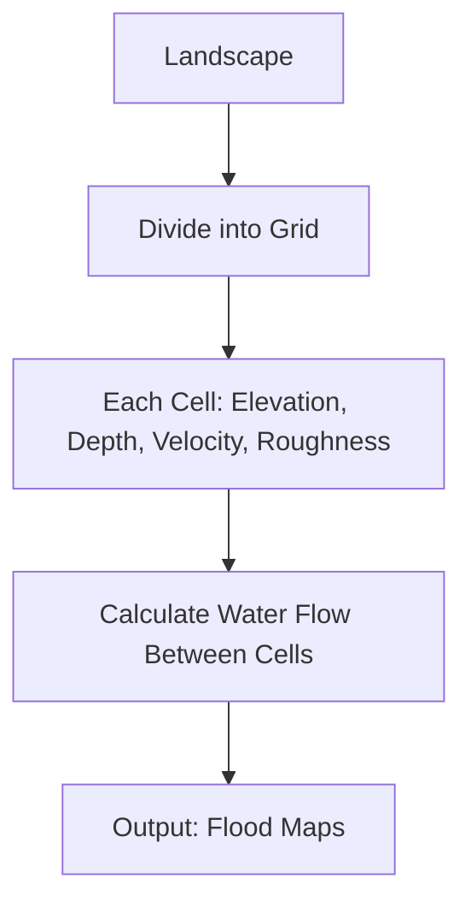
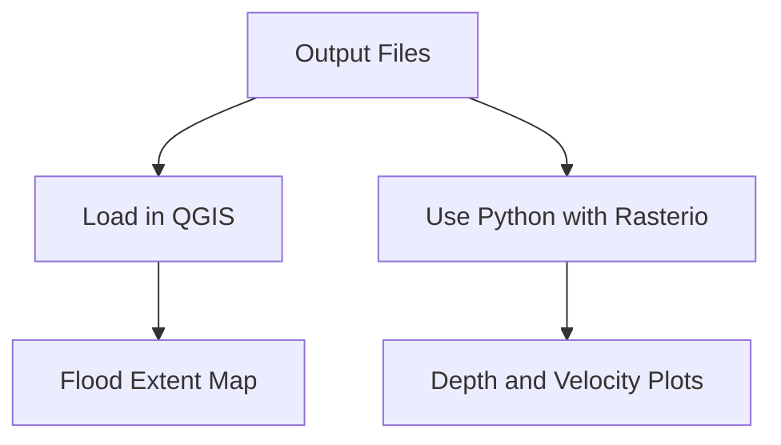
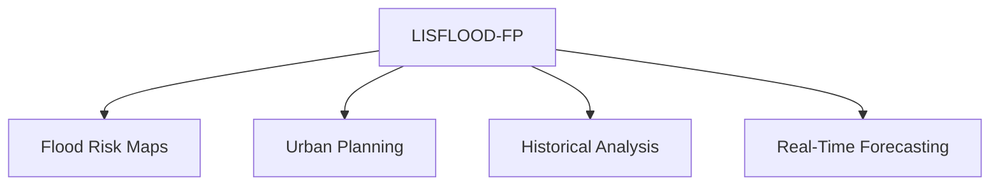

# Chapter 5: LISFLOOD-FP - A Tool for Floodplain Modeling

## Table of Contents
1. [Introduction to LISFLOOD-FP](#introduction-to-lisflood-fp)
2. [What is LISFLOOD-FP?](#what-is-lisflood-fp)
   - [Purpose and Applications](#purpose-and-applications)
   - [Key Features](#key-features)
3. [Core Concepts](#core-concepts)
   - [Hydrodynamic Modeling Basics](#hydrodynamic-modeling-basics)
   - [Raster-Based Approach](#raster-based-approach)
   - [Numerical Solvers](#numerical-solvers)
   - [Input Data Requirements](#input-data-requirements)
4. [How LISFLOOD-FP Works](#how-lisflood-fp-works)
   - [Step-by-Step Workflow](#step-by-step-workflow)
   - [Flow Diagram of the Process](#flow-diagram-of-the-process)
5. [Setting Up a Small Project](#setting-up-a-small-project)
   - [Installing LISFLOOD-FP](#installing-lisflood-fp)
   - [Preparing Input Data](#preparing-input-data)
   - [Running the Model](#running-the-model)
   - [Visualizing Outputs](#visualizing-outputs)
6. [Advanced Features in LISFLOOD-FP 8.1](#advanced-features-in-lisflood-fp-81)
   - [GPU Acceleration](#gpu-acceleration)
   - [Subgrid Channel Modeling](#subgrid-channel-modeling)
7. [Strengths and Limitations](#strengths-and-limitations)
   - [Strengths](#strengths)
   - [Limitations](#limitations)
8. [Practical Applications](#practical-applications)
9. [Tips for Success](#tips-for-success)
10. [Further Resources](#further-resources)

---

## Introduction to LISFLOOD-FP

Floods can cause significant damage to communities, infrastructure, and ecosystems. To predict and manage floods, scientists and engineers use tools like LISFLOOD-FP, a computer model that simulates how water flows across floodplains and urban areas. This chapter introduces LISFLOOD-FP, explains its core concepts, and guides you through using it for a small project. By the end, you’ll understand how it works, how to set it up, and how to apply it in real-world scenarios. The chapter uses simple language, diagrams, and examples to make learning easy and engaging.

---

## What is LISFLOOD-FP?

LISFLOOD-FP is a two-dimensional (2D) hydrodynamic model developed by the University of Bristol. It simulates how water moves over a landscape, such as a floodplain or city, during a flood. Think of it as a digital tool that creates a map showing where water will go, how deep it will be, and how fast it will flow.

### Purpose and Applications
LISFLOOD-FP is used to:
- Predict flood extent and depth for risk assessment.
- Plan urban development in flood-prone areas.
- Study historical floods to improve future preparedness.
- Support real-time flood forecasting when combined with weather data.

### Key Features
- **Grid-Based**: Divides the landscape into a grid of cells, making it easy to model large areas.
- **Multiple Solvers**: Offers different methods to calculate water flow, balancing speed and accuracy.
- **Open-Source**: Free for non-commercial use, with active development.
- **Scalable**: Works for small catchments (e.g., 10 km²) to entire continents.
- **Latest Version (8.1)**: Includes GPU acceleration for faster simulations.

---

## Core Concepts

To use LISFLOOD-FP effectively, you need to understand a few key ideas. These concepts are the building blocks of the model and are explained in simple terms below.

### Hydrodynamic Modeling Basics
Hydrodynamic models use physics to simulate water movement. They rely on two main principles:
1. **Mass Conservation**: Water doesn’t disappear; it flows from one place to another.
2. **Momentum Conservation**: Water moves based on forces like gravity (due to terrain slope) and friction (from surfaces like grass or concrete).

LISFLOOD-FP uses simplified versions of the *shallow water equations*, which describe how water flows in two directions (x and y) across a landscape. These equations are complex, so LISFLOOD-FP offers simpler methods (called solvers) to make calculations faster.

### Raster-Based Approach
LISFLOOD-FP divides the study area into a grid, like a checkerboard. Each square (or cell) in the grid has:
- **Elevation**: The height of the land, taken from a Digital Elevation Model (DEM).
- **Water Depth**: How much water is in the cell.
- **Velocity**: How fast and in which direction water flows.
- **Roughness**: A measure of how much the surface (e.g., grass, pavement) slows water down.

Water moves between cells based on their elevation and water depth. This grid approach makes it easy to work with maps and GIS tools like QGIS.



### Numerical Solvers
LISFLOOD-FP uses different solvers to calculate water flow. Each solver is like a recipe for solving the equations, with trade-offs in speed and accuracy:
- **Diffusive Solver**: Assumes water flows slowly due to gravity and slope. Fast but less accurate for fast-moving floods.
- **Inertial Solver**: Includes the effect of water’s momentum. Good balance of speed and accuracy, ideal for most projects.
- **Adaptive Solver**: Adjusts calculations to stay stable, useful for complex terrains.
- **Full 2D Solver (Roe)**: Uses the complete equations for high accuracy but is slow.

| Solver         | Speed       | Accuracy        | Best For                     |
|----------------|-------------|-----------------|-----------------------------|
| Diffusive      | Very Fast   | Low             | Slow, steady floods         |
| Inertial       | Fast        | Medium          | General flood modeling      |
| Adaptive       | Medium      | Medium          | Complex terrains            |
| Full 2D (Roe)  | Slow        | High            | Dynamic, fast-moving floods |

### Input Data Requirements
To run LISFLOOD-FP, you need:
- **Digital Elevation Model (DEM)**: A map of land heights, usually from LiDAR or satellite data.
- **Boundary Conditions**: Data on water entering the area, like river flow (hydrograph) or water levels.
- **Manning’s Roughness**: A value showing how rough the surface is (e.g., 0.03 for smooth pavement, 0.05 for forests).
- **Channel Geometry**: For rivers narrower than the grid, you need width and depth data.
- **Initial Conditions**: Starting water depths (often zero for dry areas).

---

## How LISFLOOD-FP Works

LISFLOOD-FP takes your input data, runs calculations, and produces maps showing flood extent, depth, and velocity. Here’s how it works in simple steps.

### Step-by-Step Workflow
1. **Prepare Input Data**: Collect and format your DEM, boundary conditions, and roughness data.
2. **Set Up the Model**: Create a configuration file (`.par`) to tell LISFLOOD-FP what to do.
3. **Run the Simulation**: Use the software to calculate water flow across the grid.
4. **Analyze Outputs**: Generate maps and graphs to see flood patterns.
5. **Validate Results**: Compare outputs to real-world data to ensure accuracy.

### Flow Diagram of the Process

```mermaid
graph TD
    A[Start] --> B[Collect DEM, Hydrograph, Roughness]
    B --> C[Create Configuration File (.par)]
    C --> D[Choose Solver: Inertial, Diffusive, etc.]
    D --> E[Run LISFLOOD-FP]
    E --> F[Generate Outputs: Depth, Velocity Maps]
    F --> G[Visualize in QGIS or Python]
    G --> H[Validate with Real Data]
    H --> I[Adjust Parameters if Needed]
    I --> E
```

---

## Setting Up a Small Project

Let’s walk through setting up LISFLOOD-FP for a small project, like modeling a flood in a 10 km² rural catchment. This section is practical and hands-on, perfect for students.

### Installing LISFLOOD-FP
1. **Download**: Get the latest version (e.g., LISFLOOD-FP 8.1) from the University of Bristol’s website or GitHub (openearth/lisflood-fp-bmi).
2. **Install**:
   - On Windows/Linux, use a compiler like GCC or Visual Studio.
   - For GPU acceleration, install CUDA for NVIDIA GPUs.
   - Optionally, use Python libraries like `lisflood-py` for easier setup.
3. **Test**: Run a sample project from the user manual to ensure it works.

### Preparing Input Data
For a small catchment:
- **DEM**: Use a 10m resolution DEM from LiDAR or Copernicus. Clip it to your area using QGIS.
- **Boundary Conditions**: Get a river flow hydrograph (e.g., a 100-year flood). Format as a text file:
  ```
  0 0.0
  3600 50.0
  7200 100.0
  10800 50.0
  ```
  (Time in seconds, discharge in m³/s.)
- **Manning’s Roughness**: Use 0.035 for grasslands, 0.05 for forests. Create a raster or use a single value.
- **Channel Geometry**: If the river is narrow, define its width (e.g., 10m) and depth in a separate file.
- **Configuration File**: Create a `.par` file:
  ```
  demfile dem.asc
  bdyfile inflow.bdy
  manningfile manning.asc
  solver inertial
  sim_time 86400
  output_interval 3600
  ```

### Running the Model
1. **Command Line**: Run `lisflood -f project.par` in the terminal.
2. **Python Option**: Use a script for automation:
   ```python
   from lisflood import LisfloodModel
   model = LisfloodModel('project.par')
   model.run()
   ```
3. **Check Outputs**: Look for files like `depth_0001.asc` (water depth at specific times).

### Visualizing Outputs
Use QGIS to load output files and create maps. For custom visuals, use Python:
```python
import rasterio
import matplotlib.pyplot as plt
with rasterio.open('depth_0001.asc') as src:
    depth = src.read(1)
plt.imshow(depth, cmap='Blues')
plt.colorbar(label='Water Depth (m)')
plt.title('Flood Depth Map')
plt.show()
```



---

## Advanced Features in LISFLOOD-FP 8.1

LISFLOOD-FP 8.1, released in recent years, includes new features to make simulations faster and more accurate.

### GPU Acceleration
- **What It Is**: Uses graphics cards (GPUs) to run calculations faster.
- **Why It Matters**: Speeds up large or real-time simulations, ideal for big projects.
- **How to Use**: Requires an NVIDIA GPU and CUDA. Enable in the `.par` file with `gpu 1`.

### Subgrid Channel Modeling
- **What It Is**: Models narrow rivers within coarse grids, improving accuracy without slowing down the model.
- **Why It Matters**: Captures small river details in large-scale simulations.
- **How to Use**: Define channel width and depth in a separate file (e.g., `channel.asc`).

---

## Strengths and Limitations

### Strengths
- **Efficient**: Fast for large areas due to simplified equations.
- **Flexible**: Multiple solvers suit different flood types.
- **Open-Source**: Free and customizable.
- **Integrates with GIS**: Easy to use with QGIS or ArcGIS.

### Limitations
- **Simplified Physics**: Inertial solver may miss complex flow dynamics.
- **Data Dependency**: Needs high-quality DEMs, which may not always be available.
- **Urban Challenges**: Coarse grids may not capture small urban features like streets.

| Feature                | Strength                          | Limitation                        |
|------------------------|-----------------------------------|-----------------------------------|
| Speed                  | Fast for large areas             | Slower for high-resolution grids |
| Accuracy               | Good with inertial solver        | Less accurate for complex flows   |
| Data Requirements      | Works with standard GIS data     | Needs high-quality DEMs           |
| Urban Modeling         | Handles broad urban floods       | May miss small-scale features     |

---

## Practical Applications

LISFLOOD-FP is used in:
- **Flood Risk Mapping**: Create maps for 100-year floods to guide planning.
- **Urban Planning**: Identify safe areas for buildings and roads.
- **Historical Analysis**: Reconstruct past floods to learn from them.
- **Real-Time Forecasting**: Combine with weather models for early warnings.



---

## Tips for Success

1. **Start Small**: Practice with a small area (e.g., 10 km²) and coarse grid (10m).
2. **Check Data Quality**: Ensure your DEM is accurate and free of errors.
3. **Use Inertial Solver**: It’s the best balance for most projects.
4. **Validate Results**: Compare outputs to real flood data or historical records.
5. **Learn GIS**: Tools like QGIS make data preparation and visualization easier.

---

## Further Resources

- **LISFLOOD-FP User Manual**: Detailed setup guide (available on the University of Bristol website).
- **GitHub Repository**: Source code and examples (openearth/lisflood-fp-bmi).
- **Tutorials**: University of Bristol’s training exercises for beginners.
- **Research Papers**: Look for studies on LISFLOOD-FP applications (e.g., urban flooding, Nigeria case studies).
- **GIS Tools**: Learn QGIS or ArcGIS for data processing and visualization.

---

This chapter has introduced LISFLOOD-FP, explained its core concepts, and shown you how to use it for a small project. With its open-source nature and powerful features, LISFLOOD-FP is a great tool for students and professionals studying floodplains. Practice the steps, explore the resources, and you’ll be ready to model floods with confidence!